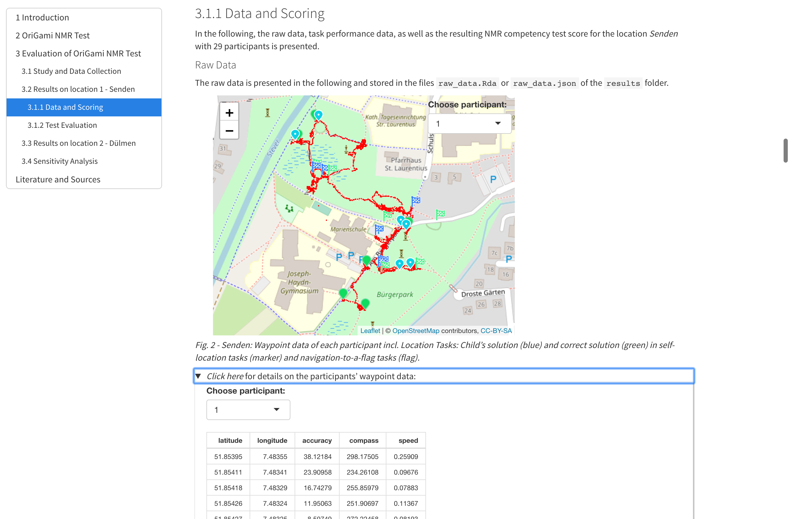
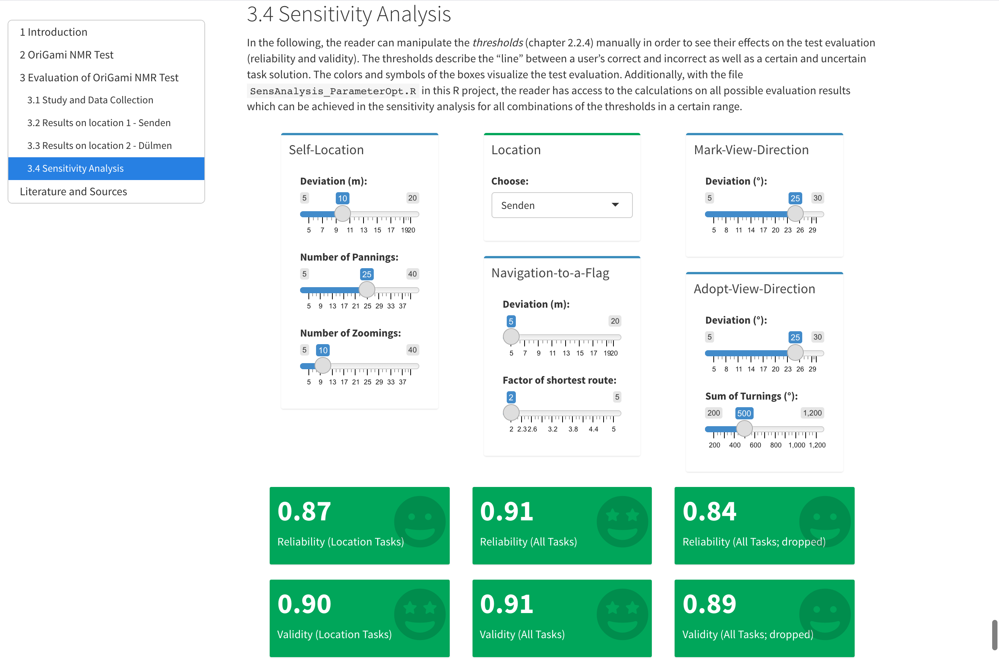

# GeoGami NMR Assessment

**Note:** We renamed the app "GeoGami". The initial name was "OriGami".

## Open Reproducible Data of the GeoGami NMR Assessment for Navigational Map Reading Competencies

On the basis of our location-based game [GeoGami](https://app.geogami.ifgi.de) we created an assessment for navigational map reading (NMR) competencies. The main aim of the following R project is to give the reader details on our NMR competency score calculation and the assessment evaluation. Moreover, we want to provide information and scripts for conducting the assessment for another location or age group.

For more information on **GeoGami** visit the [Website](https://geogami.ifgi.de).

## Project structure

**Run.Rmd**: R Markdown file that runs the project. It presents the results of our assessment evaluation to the user.

**Custom.Rmd**: R Markdown file that allows the user to evaluate his or her own assessment data for a self-chosen location (see instructions below).

**SensAnalysis_ParameterOptn.R**: R Script allowing the user to determine the minimun and maximum reliability and validity coefficients for a given range of thresholds (for details run `Run.Rmd`).

**data**: This folder contains the raw data for both data sets/locations: Senden and Dülmen. Moreover, the user can add his custom data (see instructions below).

**results**: This folder contains resulting data for both locations (for details run `Run.Rmd`) and for the users custom data (see instructions below).

**calculations**: This folder contains the R files for all calculations of this project. `Run.Rmd` and `Custom.Rmd` refer to these files and each of these files refer to the files in the related sub-folder. The whole structure of the calculation folder is based on the chapters in the resulting R Markdown file. The files are ordered in a chronological way.

**tables_and_figures**: This folder includes all plots and tables visualized in the R Markdown files `Run.Rmd` and `Custom.Rmd`.



_Fig. A: Screenshot of the R Markdown File generated by running the Run.Rmd-file: You can choose different participants to visualize their GPS track and the location where each child performed the tasks._

## Run the app

1. Install [R Studio](https://www.rstudio.com) and [R](https://www.r-project.org).

2. Download this repository to your computer (e.g. as a zip-file via the "code"-button above these files - do not forget to extract the zip-file afterwards)!

3. Open R Studio and install missing libraries by copying and pasting the following code in the R Studio Console:
   
   ```r
   install.packages("shiny") +
   install.packages("shinydashboard") +
   install.packages("kableExtra") +
   install.packages("tidyverse") +
   install.packages("lubridate") +
   install.packages("data.table") +
   install.packages("sf") +
   install.packages("ggplot2") +
   install.packages("psych") +
   install.packages("leaflet") +
   install.packages("leaflet.extras") +
   install.packages("jsonlite") +
   install.packages("moments") + 
   install.packages("DescTools")
   ```
4. Open `Run.Rmd` and run it by clicking on the "Run document" button. A shiny markdown file will be generated.



_Fig. B: Screenshot of the R Markdown File: In this sensitivity analysis you can adapt the thresholds used within the performance evaluations to show the reliability and validity for different parameter settings._

## Conduct GeoGami NMR Assessment for your own location

If you are interested in developing the assessment for your location and/or another target group of interest (e.g. another age group), you have to proceed as follows:

1. Install GeoGami on your mobile devices (see [GeoGami website](https://geogami.ifgi.de) for further instructions). Information on the devices can be found in `Run.Rmd`, chapter 2. 

2. Create an GeoGami account and contact us for getting the right user role to get access to your data.

3. Create a game in GeoGami with the structure described in `Run.Rmd`, chapter 2. `Run.Rmd` is a test manual for using GeoGami to assess NMR competencies.

4. Conduct the assessment. Use numbers for your participants instead of real names! _Note: A mobile Internet connection is needed for conducting the test (SIM card). However, if the Internet connection breaks (due to the bad Internet signal in park areas), it is nevertheless possible to continue playing the game started. The data won't be uploaded to the server then, but this can be fixed by uploading it later (via pressing the cloud-button in the evaluation mode of GeoGami)._

5. Save one json-logfile for all your data on your computer.

6. Edit your json-file via R as follows:

- Create a data.frame with: `logfile <- fromJSON(...)`

- Reduce your data to the following columns: `waypoints` (data.frame), `events` (data.frame), `players` (numeric), `name` (character), `start` (POSIXct), `end` (POSIXct) and delete unneeded columns:

```r
logfile <- select (logfile, -answers, -device, -`__v`, -updatedAt, -createdAt, -game, -playersCount, -`_id`)
```

- Format the timestamps (see columns: `end`, `start`, `waypoints.timestamp` and `events.timestamp`) as follows:

```r
timestamp <- as.POSIXct(timestamp, "%Y-%m-%dT%H:%M:%S", tz = "UTC")
logfile$start <- lubridate::with_tz(logfile$start, "MET")
```

- Save your resulting data as `logfile.Rda` and replace the logfile in the `data/custom` folder.

7. Open `Custom.Rmd` in R Studio and run the file. An R-Markdown file will be generated. You will get information on your test items as well as on the test reliability.

8. In order to examine the validity of your assessment, expert judgments are needed. Add a csv-file with your expert data in the data/custom folder (first column: `participant`; second column: `expertscoring`). Use the same participant numbers as in your logfile. Add the validity code chunk from `Run.Rmd` to include the validation calculation.

## Contact

Spatial Intelligence Lab (SIL)

Institute for Geoinformatics

University of Münster

Heisenbergstraße 2

48149 Münster

**Mail:** geogami.ifgi(at)uni-muenster.de

**Team:** https://geogami.ifgi.de/kontakt.html#team

## License

The script (all Rmd- and R-files of this project), is licensed under GPL v. 3.0 License, see file LICENSE part 1.

The data (see folder `data` and `results`) are under CC BY-NC-ND 4.0 Licence, see file LICENSE part 2.

Copyright (C) 2021 - GeoGami.
