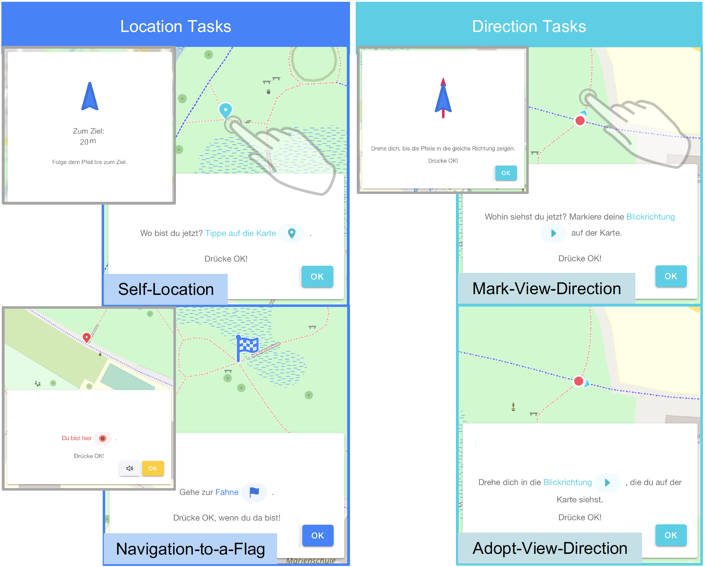

```{r setup, include=FALSE}
knitr::opts_chunk$set(echo = TRUE)
```

```{css, echo=FALSE}
pre {
  max-height: 300px;
  overflow-y: auto;
}

pre[class] {
  max-height: 300px;
}
```

```{r logfile, echo=FALSE, message=FALSE, warning=FALSE}
library("shiny")
library("shinydashboard")
library("kableExtra")
library("tidyverse")
library("lubridate")
library("data.table")
library("rgdal")
library("sf")
library("sp")
library("ggplot2")
library("psych")
library("leaflet")
library("leaflet.extras")
library("jsonlite")
library("moments")
library("DescTools")
```

# 1 Introduction

On the basis of the location-based game [GeoGami](https://origami.ifgi.de), we created an assessment for measuring navigational map reading (NMR) competencies in children aged six to ten. The assessment addresses competencies in orientating with a map in a real-world environment. We evaluated the assessment by conducting a study with 51 primary school students.

The following **evaluation script** gives the reader a detailed insight in:

- The design of GeoGami NMR assessment and the score calculation (chapter 2).

- The evaluation of the assessment on the basis of the data from the study (chapter 3).

The aim of the script is to enhance the related [publication](https://psyarxiv.com/yps2n/) with details on the assessment design and the NMR competency score as well as on the assessment evaluation. The reader can use the script to reproduce the results of the publication or to develop an own assessment for his/her location or target group of interest (see `README.md` and run `Custom.Rmd` for more details).

# 2 GeoGami NMR Assessment

The assessment is designed for measuring navigational map reading (NMR) competencies and based on the location-based game GeoGami (implementation details [on Github](https://github.com/origami-team/origami)). For evaluating it, we implemented the assessment for two locations within the GeoGami application. In the following, we describe the overall design of the assessment.

## 2.1 Assessment Design

The following description gives the reader a detailed overview of the design of GeoGami NMR assessment.

### 2.1.1 Location and Map

The assessment is designed for park areas with a branched network of paths and a range of repetitive objects for orientation. The map of the park must not include house numbers or street names in order to focus the children on spatial aspects while reading the map. The assessment requires a detailed mapping of paths and objects of the location which can be enhanced (and was enhanced by us for our chosen locations) on [openstreetmap.org](https://www.openstreetmap.org/) with benches, trash cans, fences, trees, and further details.

### 2.1.2 Tasks

The assessments consists of four NMR task types which are ordered in two groups: Location Tasks and Direction Tasks. _Location Tasks_ (fig. 1 left) include tasks that ask to mark the own location on the map (self-location tasks) or to change the location according to the map (navigation-to-a-flag tasks). _Direction Tasks_ (fig. 1 right) cover tasks that require to mark the current view direction on the map (mark-view-direction tasks) or to change it according to the map (adopt-view-direction tasks). Between these tasks so-called _Transition Tasks_ allow a coherent flow of the assessment (fig. 1 grey boxes).

{width=80%}

The assessment consists of six self-location and six navigation-to-a-flag tasks with always a pair of two tasks in the same area, with similar objects around, and the same walk-direction (N, S, or W/E). Furthermore, it contains four mark-view-direction and four adopt-view-direction tasks with two tasks for each cardinal direction. The assessment includes tasks with different levels of difficulty (e.g. regarding the number and arrangement of paths and objects, the user’s walk direction, and the amount of similar locations in one area). During the assessment, the user always has a complete view of the map with a yellow line marking the test area. During each task, the map zooms into the spots of interest (directly or when clicking on the map) to ensure the same maximum zoom level for each participant (map feature: "zoom to task"). The map rotation is always fixed to north, there is no supportive position or view direction marker and no feedback on the correctness of the solution.

<details>
  <summary>_Click here_ for details on the tasks:</summary>
```{r tab1, echo = FALSE}
z <- 0
src <- lapply(z, function(z) knitr::knit_expand(file = "tables_and_figures/tab01_testdesign.Rmd"))
```
`r knitr::knit(text = unlist(src))`
  </summary>
</details>
_Tab. 1: GeoGami NMR assessment tasks - the order of the tasks can vary depending on the location and its conditions._

### 2.1.3 Target Group

GeoGami NMR assessment was evaluated for the age group 6 to 10 (see chapter 3). However, the assessment might also be interesting for measuring NMR competencies in older children. If the reader of the script is interested in investigating the competencies of older children, he or she can use the assessment design described and this R script for conducting and evaluating it with another age group.

### 2.1.4 Technical Requirements

The assessment is a digital game in our app GeoGami. We implemented it for two different locations, but it is also possible to create the assessment for further locations.

The app GeoGami can be installed on different mobile devices (iOS or Android mobile phones and tablets). However, the assessment is designed for tablets allowing the user to see a large map section with a lot of details at once. We use the iPad (7th generation) with a 10.2" display in the Wi-Fi cellular version for having continuous mobile Internet connection during the assessment. A SIM card is needed to assure an accurate GPS localization. 

For further information on GeoGami (on how to install and use it), see the [GeoGami Website](https://origami.ifgi.de).

### 2.1.5 Assessment Execution

Each participant completes the assessment individually without the influence of other participants. The participant is accompanied by a test coordinator who follows him/her in the real environment with some distance. In advance, the test coordinator explains the tablet usage and tasks to the participant and the participant has the opportunity to test the tasks in a tutorial game (closely located to the test area). The participant is asked to explain the test coordinator his/her understanding of the map, the map symbols, and their meanings (he/she is corrected, if necessary). During the tutorial, the test coordinator points to a prominent landmark (which is also close to the test area) in the real-world as well as on the map in order to give the participant some support for the first orientation in the assessment. 

As the target group is very young, parents are asked to remain in the test area during the assessment. They are allowed to observe the assessment by far, but not to speak to or disturb their child when solving tasks.

During and after the tutorial, the test coordinator gives the participant information and instructions on the assessment (list 1) and on the different tasks (list 2) (note: with the participants we use the word "game" instead of "assessment"). During the assessment, the test coordinator is allowed to answer questions, but not to give any hints on the task solutions (list 3).

<details>
  <summary>_Click here_ for the information and instructions on the assessment given to the participant during the tutorial:</summary>
```{r list1, echo = FALSE}
src <- lapply(z, function(z) knitr::knit_expand(file = "tables_and_figures/list01_tutorialinstructions1.Rmd"))
```
`r knitr::knit(text = unlist(src))`
</details>
_List 1: Information and instructions on the assessment given to the participant during the tutorial._

<details>
  <summary>_Click here_ for the instructions on the tasks given to the participant during the tutorial:</summary>
```{r list2, echo = FALSE}
src <- lapply(z, function(z) knitr::knit_expand(file = "tables_and_figures/list02_tutorialinstructions2.Rmd"))
```
`r knitr::knit(text = unlist(src))`
</details>
_List 2: Instructions on the tasks given to the participant during the tutorial._

<details>
  <summary>_Click here_ for the instructions given to the participant during the assessment:</summary>
```{r list3, echo = FALSE}
src <- lapply(z, function(z) knitr::knit_expand(file = "tables_and_figures/list03_testinstructions.Rmd"))
```
`r knitr::knit(text = unlist(src))`
</details>
_List 3: Instructions given to the participant during the assessment._

For further information on the assessment, see the related [publication](https://psyarxiv.com/yps2n/).

## 2.2 Data and Scoring

On each game played with GeoGami, data is created which is mainly based on data of the device's sensors and the [mapbox mapping service](https://docs.mapbox.com/mapbox-gl-js/api/). We used this data to determine a NMR competency score that describes the user's competencies in NMR (i.e. in the Location and Direction Tasks). The script is written for complete data sets. Incomplete gameplays need to be deleted from the data set before using the script.

### 2.2.1 Raw Data

On each gameplay a `logfile.json` is stored which contains waypoint and event data on the user's interaction with the map and his/her surrounding. The logfiles we are working with in this script encompass all gameplays of each location in one file.

The _waypoint data_ (tab. 2) is gained via the device's GPS sensor and compass sensor. It includes the user's locations (track), view directions (tablet orientation), velocity, and the GPS accuracy. This data is collected in an interval of 1s. 

<details>
  <summary>_Click here_ for details on the waypoint data:</summary>
```{r tab2, echo = FALSE}
src <- lapply(z, function(z) knitr::knit_expand(file = "tables_and_figures/tab02_waypointdata.Rmd"))
```
`r knitr::knit(text = unlist(src))`
  </summary>
</details>
_Tab. 2: Waypoint Data collected in GeoGami NMR assessment._

The _event data_ (tab. 3) contains event information on the user's interactions with the map and the environment collected via the device's sensors or with the mapbox mapping service. It includes task answers, information on the existence, number, and location of click, pan, and zooms of the map, as well as the user's location, velocity, and view direction while solving the tasks. In addition, the event data encompasses the game settings like "correct" or "ideal" task solutions and map settings.

<details>
  <summary>_Click here_ for details on the event data:</summary>
```{r tab3, echo = FALSE}
src <- lapply(z, function(z) knitr::knit_expand(file = "tables_and_figures/tab03_eventdata.Rmd"))
```
`r knitr::knit(text = unlist(src))`
  </summary>
</details>
_Tab. 3: Event Data collected in GeoGami NMR assessment._

### 2.2.2 Derived Data

We use the waypoint and event data to _derive further data_ (tab. 4) like distances and angles describing the deviation of the participant's solution (location or view direction) from the "correct" solution and as well as the information on route lengths walked and the turning movements.

<details>
  <summary>_Click here_ for details on the derived data:</summary>
```{r tab4, echo = FALSE}
src <- lapply(z, function(z) knitr::knit_expand(file = "tables_and_figures/tab04_calculateddata.Rmd"))
```
`r knitr::knit(text = unlist(src))`
  </summary>
</details>
_Tab. 4: Derived data from GeoGami NMR assessment._

### 2.2.3 Task Performance

In order to evaluate the user's performance in each task, we decided on using the data in forms of accuracy and process data (tab. 5). The _accuracy data_ contains the user’s task solving accuracy (i.e. calculated distances and angles between the "correct" and the user's solution). The _process data_ gives further information on the user's behavior while solving the tasks (his/her number of pan and zoom events, his/her route length walked, as well as the sum of his/her turning movements) and has the potential to describe the user's confidence in solving the tasks.

The calculated distances (in m) were corrected as follows: We subtracted the GPS inaccuracy values from the distances. Then, we replaced negative results by zero. For each task and for each participant, we used the GPS inaccuracy value that was detected when the participant confirmed his or her task answer via OK-button.

<details>
  <summary>_Click here_ for details on the task performance data:</summary>
```{r tab5, echo = FALSE}
src <- lapply(z, function(z) knitr::knit_expand(file = "tables_and_figures/tab05_taskperformance.Rmd"))
```
`r knitr::knit(text = unlist(src))`
  </summary>
</details>
_Tab. 5: Task performance data - accuracy and process data derived from the raw and calculated data._

### 2.2.4 NMR Competency Score

For evaluating the user's NMR competencies, we determine an _NMR competency score_ based on the accuracy and process data. For the accuracy (representing the "correctness" of a solution) we score 1 point for a correct and 0 points for a wrong solution. In the case of a correct solution, we also take the process data into account (potentially representing the "confidence" in solving the task): We score 1 point for a "confident" and 0 points for an "inconfident" solution. The performance of a user in a certain task is therefore scored with: 0 points for a wrong solution, 1 point for a right but inconfident solution, and 2 points for a right and confident solution. In order to define a "right" or "wrong" as well as a "confident" or "inconfident" solution, we made some assumptions which are explained in detail in the related [publication](https://psyarxiv.com/yps2n/).

Knowing that the evaluation of the assessment is affected by the definition of the thresholds, we added a manual _sensitivity analysis_ at the end of this script allowing the reader to manipulate the thresholds and investigating its effects on the assessment evaluation. Additionally, with the file `SensAnalysis_ParameterOpt.R` in this R project, the reader has access to the calculations on all possible evaluation results which can be achieved in the sensitivity analysis for all combinations of the thresholds in a certain range. Moreover, if interested in conducting the assessment at another location, the reader is free to change the thresholds according to the characteristics of the chosen location in `calculation/1_data_and_scoring.Rmd` (line: 94 - 103).

# 3 Assessment Evaluation

We evaluated GeoGami NMR assessment for two different locations by conducting a study with 51 primary school students by determining and investigating their NMR competency scores. For both locations, we did an analysis of the assessment based on the ideas of the _classical test theory_: We did an item analysis (via item-total correlation and task difficulties) and estimated the reliability. Furthermore, we did a validation by correlating the score with the expert judgments.

The assessment evaluation gives the reader a first idea of the expressive power of the assessment. It describes _one_ possible way to score the data and based on _assumptions_ that still need to be proven on the basis of a larger sample size (for details see: related [publication](https://psyarxiv.com/yps2n/)).

In the following, we present the results for both locations separately - for the whole assessment and for Location Tasks individually as well as _with_ or _without_ process data included. At the end of the script, we offer a sensitivity analysis on the thresholds for scoring the accuracy and process data regarding their effects on the evaluation results.

Details on the description and interpretation of the results are presented in the corresponding [publication](https://psyarxiv.com/yps2n/). In this script the focus is on data details, the score calculations, and the assessment evaluation calculations.

## 3.1 Study and Data Collection

We conducted an evaluation study on the assessment at two different locations: The Citizens Park in Senden and the Wildlife Park in Dülmen, Germany. 51 primary school students aged six to ten (age: MD = 8.33, SD = 1.11; 29 boys, 22 girls) participated in the study and their NMR competency score was calculated. Additionally, we asked experts to evaluate the children's NMR competencies based on their observations and the children's think-aloud statements. For details on the study and methodology, see the corresponding [publication](https://psyarxiv.com/yps2n/).

The tutorials conducted can be found here: [Tutorial Senden](https://app.origami.ifgi.de/play-game/game-detail/60bf2fb02e3801b40064c179), [Tutorial Dülmen](https://app.origami.ifgi.de/play-game/game-detail/60bf2ff72e3801b40064c17b).

The assessment games for these locations can be found here: [GeoGami NMR Assessment Senden](https://app.origami.ifgi.de/play-game/game-detail/60bf2fe22e3801b40064c17a), [GeoGami NMR Assessment Dülmen](https://app.origami.ifgi.de/play-game/game-detail/60bf301f2e3801b40064c17c).

The Open Street Map material for these locations can be found here: [Test area Senden](https://www.openstreetmap.org/#map=18/51.85402/7.48372), [Test area Dülmen](https://www.openstreetmap.org/#map=17/51.83135/7.25875).

_(If the links do not work, try another browser - e.g. Chrome)_

The data of the study (`logfile.Rda` or `logfile.json`) can be found in the folder `data` in this R project. For data security purposes, we decided to change the timestamps and the participants' chiffres. The _experts judgments_ on the NMR competencies can be found in the file `experts.csv`: We asked the experts to evaluate each student's NMR performance on a scale from 0 to 10, whereas 0 stands for _no_ NMR competencies and 10 for _complete_ NMR competencies.

## 3.2 Results on location A - Senden
_**Location 1:** Senden, Citizens Park_

```{r load logfile senden, echo=FALSE}
load("data/senden/logfile.Rda")
z <- 1 # defines chunk numbers
tabmin <- 0 # defines table numbers
figmin <- 0 # defines figure numbers
ofrunfile <- "" # placeholder for custom-file
```

### 3.`r {{z}}`.1 Data and Scoring

```{r, echo = FALSE}
src <- lapply(z, function(z) knitr::knit_expand(file = "calculations/1_data_and_scoring.Rmd"))
```
`r knitr::knit(text = unlist(src))`

### 3.`r {{z}}`.2 Assessment Evaluation

```{r, echo = FALSE}
src <- lapply(z, function(z) knitr::knit_expand(file = "calculations/2_testeval_items_reliability.Rmd"))
```
`r knitr::knit(text = unlist(src))`

```{r, echo = FALSE}
src <- lapply(z, function(z) knitr::knit_expand(file = "calculations/3_testeval_scoredistrib_validity.Rmd"))
```
`r knitr::knit(text = unlist(src))`

## 3.3 Results on location B - Dülmen
_**Location 2:** Dülmen, Wildlife Park_

```{r load logfile duelmen, echo=FALSE}
load("data/duelmen/logfile.Rda")
z <- z+1 # defines chunk numbers
```

### 3.`r {{z}}`.1 Data and Scoring

```{r, echo = FALSE}
src <- lapply(z, function(z) knitr::knit_expand(file = "calculations/1_data_and_scoring.Rmd"))
```
`r knitr::knit(text = unlist(src))`

### 3.`r {{z}}`.2 Assessment Evaluation

```{r, echo = FALSE}
src <- lapply(z, function(z) knitr::knit_expand(file = "calculations/2_testeval_items_reliability.Rmd"))
```
`r knitr::knit(text = unlist(src))`

```{r, echo = FALSE}
src <- lapply(z, function(z) knitr::knit_expand(file = "calculations/3_testeval_scoredistrib_validity.Rmd"))
```
`r knitr::knit(text = unlist(src))`

## 3.4 Sensitivity Analysis

```{r, echo = FALSE}
src <- lapply(z, function(z) knitr::knit_expand(file = "calculations/4_testeval_sensanalysis.Rmd"))
```
`r knitr::knit(text = unlist(src))`

# Literature and Sources

GeoGami NMR assessment is based on some basic ideas of the following related literature:

_Lobben, A. K. (2007). Navigational Map Reading: Predicting Performance and Identifying Relative Influence of Map-Related Abilities. Annals of the Association of American Geographers, 97(1), 64-85._

_Hemmer, I., Hemmer, M., Kruschel, K., Neidhardt, E., Obermaier, G., & Uphues, R. (2013). Which Children Can Find a Way Through a Strange Town Using a Streetmap? - Results of an Empirical Study on Children's Orientation Competence. International Research in Geographical and Environmental Education, 22(1), 23-40._

For further related literature, see the corresponding [publication](https://psyarxiv.com/yps2n/).

**Note:** We do not assume any liability for the websites and sources linked by us.